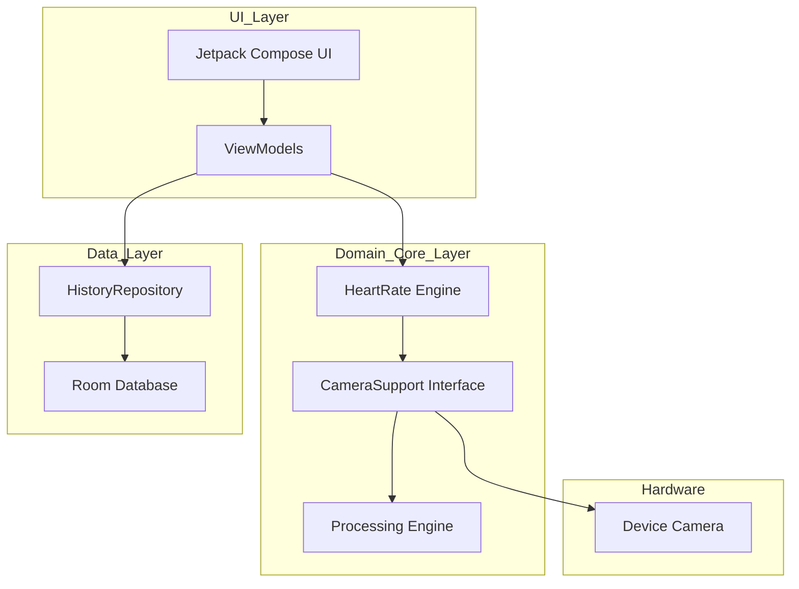

# Architecture Guide

This document describes the high-level architecture of the Heart Rate Monitor app.

## High-Level Diagram

## Layers Description

### 1. UI Layer
*   **Jetpack Compose:** Uses a modern declarative approach to build the UI.
*   **ViewModels:** Use `StateFlow` to expose state to the UI and `viewModelScope` for asynchronous operations.
*   **Hilt:** Handles dependency injection for ViewModels.

### 2. Domain / Core Layer
*   **HeartRate Engine:** Manages the lifecycle of a measurement (start, stop, timer). It implements the `PreviewListener` to receive data from the camera.
*   **CameraSupport:** A hardware abstraction layer. Currently implemented using **CameraX**, but can be swapped easily due to its interface-based design.
*   **Processing Engine:** Specialized logic that converts camera frames into "redness" values used for pulse detection.

### 3. Data Layer
*   **HistoryRepository:** The single source of truth for heart rate history data.
*   **Room Database:** Handles local persistence of history models.

## Data Flow (Unidirectional Data Flow)
1.  **User Action:** User taps "Start" in the UI.
2.  **ViewModel:** Updates state to `isStarted = true` and calls `HeartRate.startPulseCheck()`.
3.  **Engine:** Opens the camera and starts a timer.
4.  **Hardware/Core:** Camera frames are processed; the engine calculates BPM and emits results via a listener.
5.  **ViewModel:** Receives BPM updates and pushes them to the UI via `beatsPerMinute` StateFlow.
6.  **Persistence:** Upon completion, the user can save the result, which flows through the ViewModel to the Repository and into the Room database.
